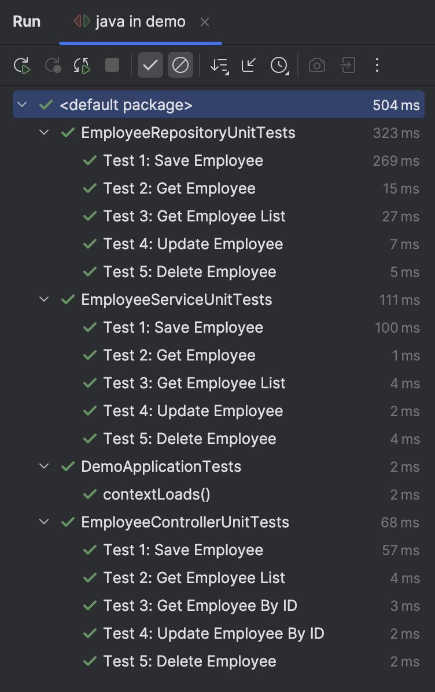

# spring-demo-5 JUnit and Mockito
Spring Boot unit testing for Repositories, Controllers and Services using JUnit 5 and Mockito.
- Repository: JUnit
- Controller: JUnit and Mockito
- Service layer: JUnit and Mockito

